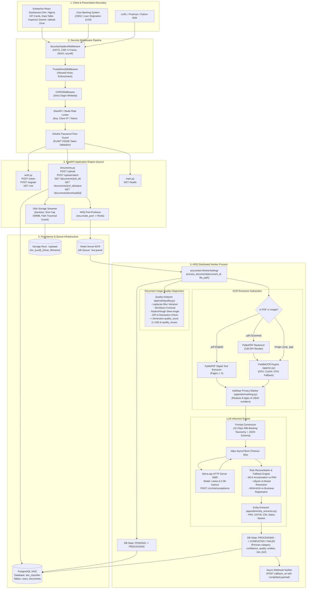
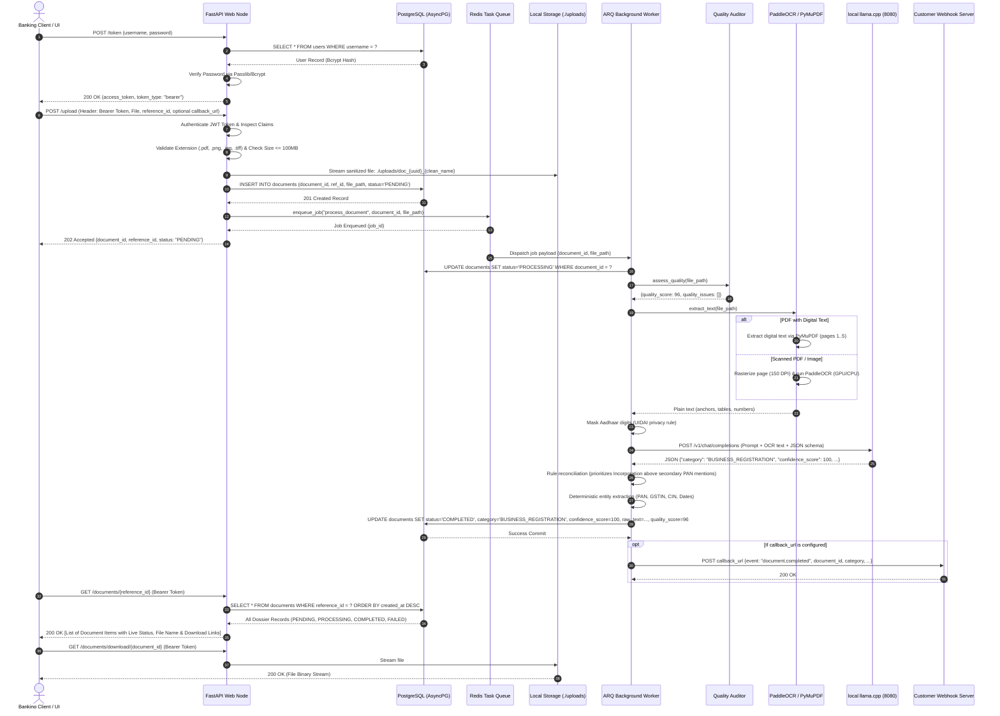
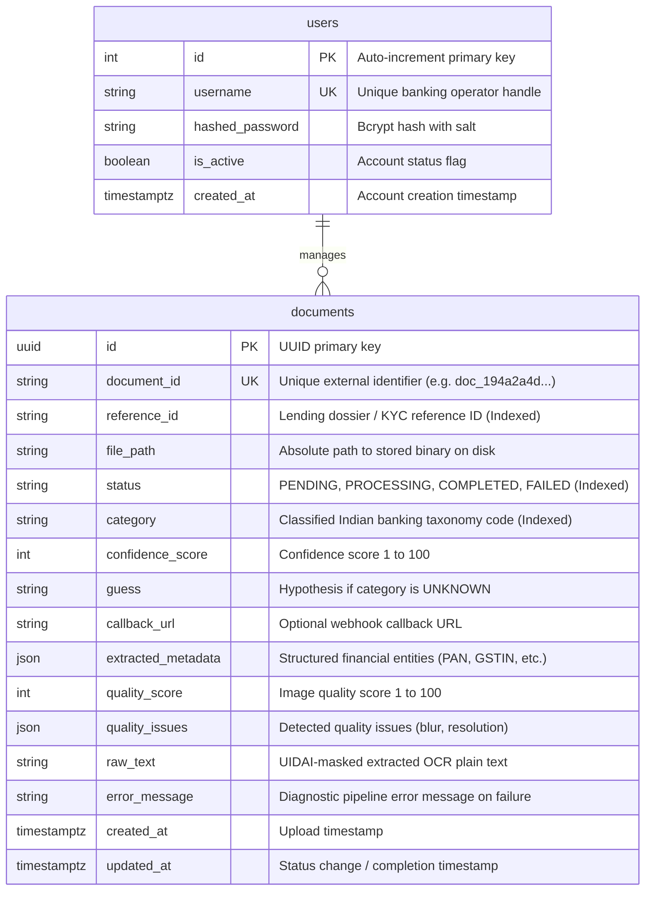
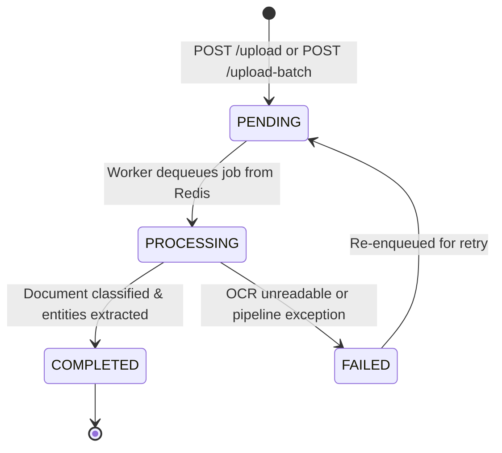

# Low-Level Architecture & Technical Specification 📐🏛️

This document describes the low-level architectural design, component interactions, sequence flows, data contracts, and security enforcement boundaries of the **Indian Financial Document Classification Engine**.

---

## 1. Low-Level Component Architecture Diagram

---

## 2. End-to-End Ingestion & Processing Sequence Diagram

---

## 3. Database Entity-Relationship (ER) Model

---

## 4. Document State Machine Transitions

---

## 5. Security & Threat Modeling Matrix

| Threat Vector | Mitigation Strategy | Enforcement Module |
| :--- | :--- | :--- |
| **DDoS / GPU Exhaustion** | SlowAPI rate limiter (10 uploads/min per IP, 60 req/min for queries) backed by Redis. | [app/limiter.py](file:///f:/doc-classification-engine/app/limiter.py) |
| **Directory Traversal** | Filename sanitization (`[^a-zA-Z0-9_.-]`), path containment verification inside `UPLOAD_DIR`. | [app/routers/documents.py](file:///f:/doc-classification-engine/app/routers/documents.py) |
| **MIME Sniffing & Clickjacking** | Strict security headers: `X-Content-Type-Options: nosniff`, `X-Frame-Options: DENY`, `HSTS`. | [app/middleware.py](file:///f:/doc-classification-engine/app/middleware.py) |
| **Host Header Poisoning** | Explicit whitelist of accepted Host headers via Starlette middleware. | [app/main.py](file:///f:/doc-classification-engine/app/main.py) |
| **CORS Infiltration** | Strict whitelist: `http://localhost:5173`, `http://localhost:3000`, `http://localhost:8000` (no wildcard `*`). | [app/main.py](file:///f:/doc-classification-engine/app/main.py) |
| **Unauthorized Data Access** | OAuth2 Password Flow with PyJWT cryptographically signed tokens (HS256). | [app/security.py](file:///f:/doc-classification-engine/app/security.py) |
| **Unbounded File Bomb** | Chunked streaming write that aborts and deletes files exceeding `MAX_FILE_SIZE_BYTES` (100MB). | [app/routers/documents.py](file:///f:/doc-classification-engine/app/routers/documents.py) |
| **PII / UIDAI Compliance** | Automated masking of Aadhaar digits (first 8 digits masked) before raw OCR text is persisted. | [app/utils/masking.py](file:///f:/doc-classification-engine/app/utils/masking.py) |
